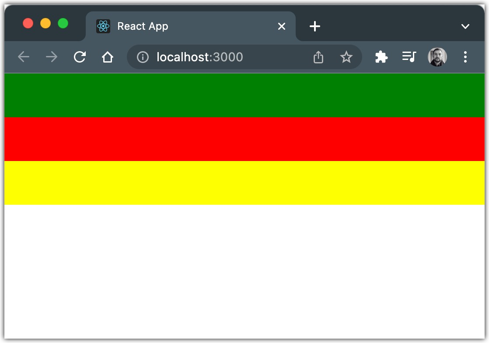

# CSS
```css
.main {
      background-color: red;
      width: 100%;
      height: 50px;
}

.secondary {
      background-color: green;
      width: 100%;
      height: 50px;
}

/*Set background color of anotherClass element only
 if it is placed after myClass element  */
.main + .secondary {
      background-color: yellow;
}

```
```tsx
export const PlainCSS: React.FC = () => {
    return (
        <>
            <div className="secondary" />
            <div className="main" />
            <div className="secondary" />
        </>
    );
};
```

# Styled components
```tsx
export const StyledComponents: React.FC = () => {
    return (
        <>
            <Styled.Secondary />
            <Styled.Main />
            <Styled.Secondary />
        </>
    );
};
```

# Result 

