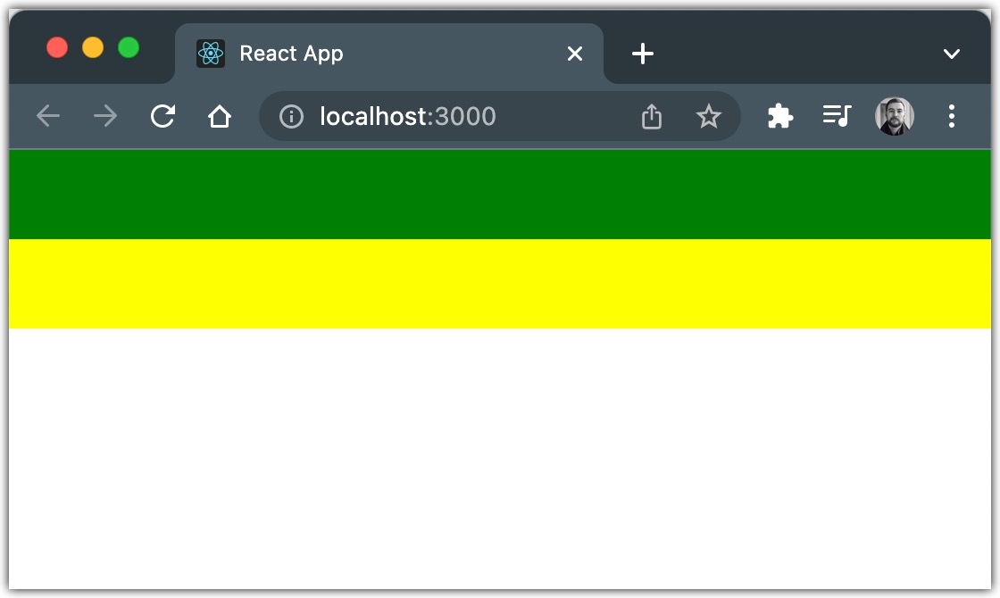

# CSS
```css
.main {
      background-color: red;
      width: 100%;
      height: 50px;
}

.secondary {
      background-color: yellow;
      width: 100%;
      height: 50px;
}

.main > .secondary {
      background-color: green;
}
```
```tsx
export const PlainCSS: React.FC = () => {
    return (
        <>
            <div className="main">
                <div className="secondary" />
            </div>
            <div className="secondary" />
        </>
    );
};
```

# Styled components
```tsx
import React from 'react';
import styled from 'styled-components';

export const Main = styled.div`
    background-color: red;
    width: 100%;
    height: 50px;
`;

export const Secondary = styled(Main)`
    background-color: yellow;
    ${Main} > & {
        background-color: green;
    }
`;

export const Styled = {
    Main,
    Secondary,
};

export const StyledComponents: React.FC = () => {
    return (
        <>
            <Styled.Main>
                <Styled.Secondary />
            </Styled.Main>
            <Styled.Secondary />
        </>
    );
};
```

# Result 

